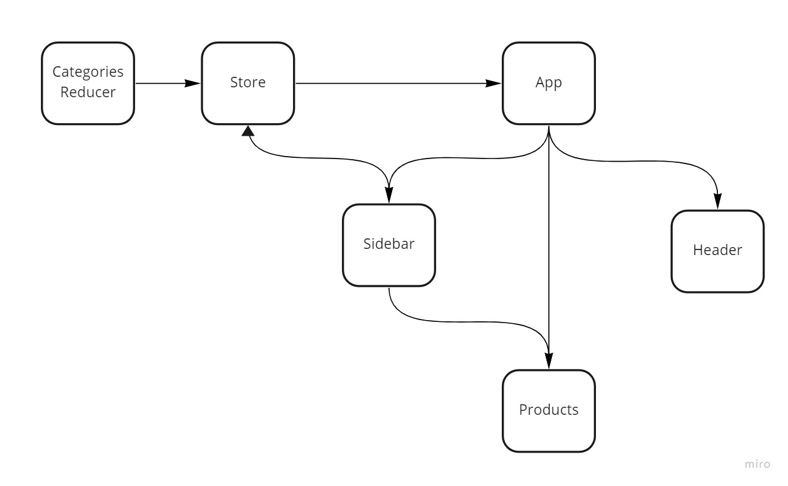

# storefront

An online storefront that will allow our users to browse our product offerings by category, place items in their shopping cart, and check-out when they are ready to make their purchase

## Phase one

[PR Link](https://github.com/karamalqinneh/storefront/pull/1)

[Deployed Version](https://storefront-karam.netlify.app/)

### UML

## Phase two

[PR Link](https://github.com/karamalqinneh/storefront/pull/2)

[Deployed Version](https://storefront-karam.netlify.app/)

### UML

## Phase three

[Commit Link](https://github.com/karamalqinneh/storefront/commit/fa8fc49d16d2e741f81f3b90524c1ee604018f90)

[Deployed Version](https://storefront-karam.netlify.app/)
